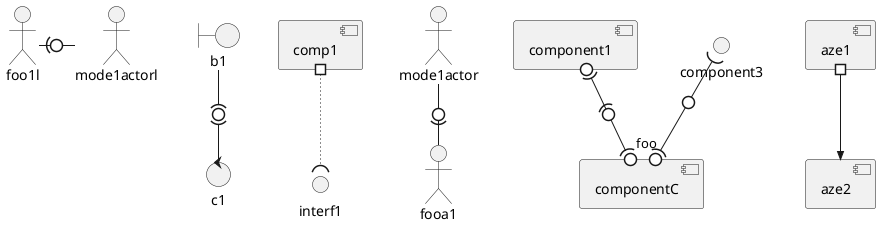
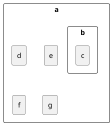
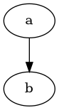
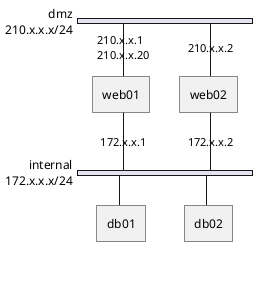

```plantuml
@startuml
boundary b1
control c1
b1 -(0)- c1

component comp1
interface interf1
comp1 #~~( interf1

:mode1actor: -0)- fooa1
:mode1actorl: -le0)- foo1l

[component1] 0)-(0-(0 [componentC]
() component3 )-0-(0 "foo" [componentC]

[aze1] #-->> [aze2]
@enduml
```

```plantuml
@startuml
rectangle a {
    rectangle b {
        rectangle c {

        }
    }
    rectangle d
    rectangle e
    rectangle f
    rectangle g
}
@enduml
```

```plantuml
@startdot


digraph G {
    a->b
}
@enddot
```

```plantuml
@startuml
nwdiag {
  network dmz {
      address = "210.x.x.x/24"

      // set multiple addresses (using comma)
      web01 [address = "210.x.x.1, 210.x.x.20"];
      web02 [address = "210.x.x.2"];
  }
  network internal {
      address = "172.x.x.x/24";

      web01 [address = "172.x.x.1"];
      web02 [address = "172.x.x.2"];
      db01;
      db02;
  }
}
@enduml
```